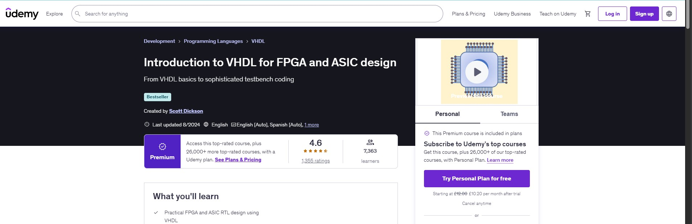

# FPGA Bootcamp Labs – VHDL Design with Vivado

This repository contains **6 FPGA/VHDL lab projects** completed as part of the Udemy course:
*“From VHDL Basics to Sophisticated Testbench Coding” by Scott Dickson.*

The labs progressively build a **digital thermostat system** using **Xilinx Vivado**, starting with basic multiplexers and extending to flip-flops, state machines, and verification with self-checking testbenches.

### 📂 Repository Structure

Each lab folder includes:

* **VHDL source code** (entity + architecture)
* **Testbench files** for simulation
* **Simulation waveforms** generated in Vivado

### 🧑‍💻 Labs Overview

1. **Lab 1** – Basic Multiplexer (thermostat display select)
2. **Lab 2** – Add Logic to Thermostat Design
3. **Lab 3** – Adding Flip-Flops
4. **Lab 4** – Creating a State Machine
5. **Lab 5** – Add Counter to State Machine
6. **Lab 6** – Self-Checking Testbench

### 🛠 Tools Used

* **Xilinx Vivado Simulator**
* VHDL (behavioral + structural modeling)
* Testbenches for verification

---
