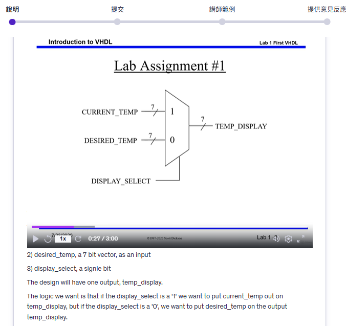

# Lab 1 – Basic Multiplexer (Thermostat Display Select)

This lab introduces a simple **7-bit multiplexer** for a thermostat system.  
We have two inputs:
- `CURRENT_TEMP` (7-bit vector)  
- `DESIRED_TEMP` (7-bit vector)  

And one control signal:
- `DISPLAY_SELECT` (1 bit)  

The output is:
- `TEMP_DISPLAY` (7-bit vector)  

### Logic Description
- If `DISPLAY_SELECT = '1'`, then the output shows **CURRENT_TEMP**  
- If `DISPLAY_SELECT = '0'`, then the output shows **DESIRED_TEMP**  

### Block Diagram

