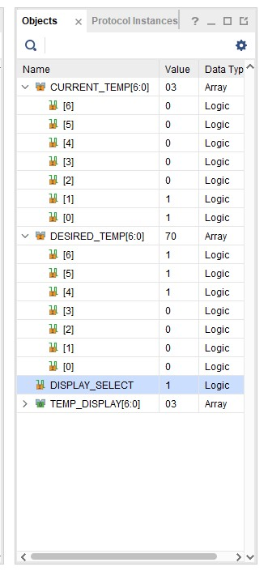
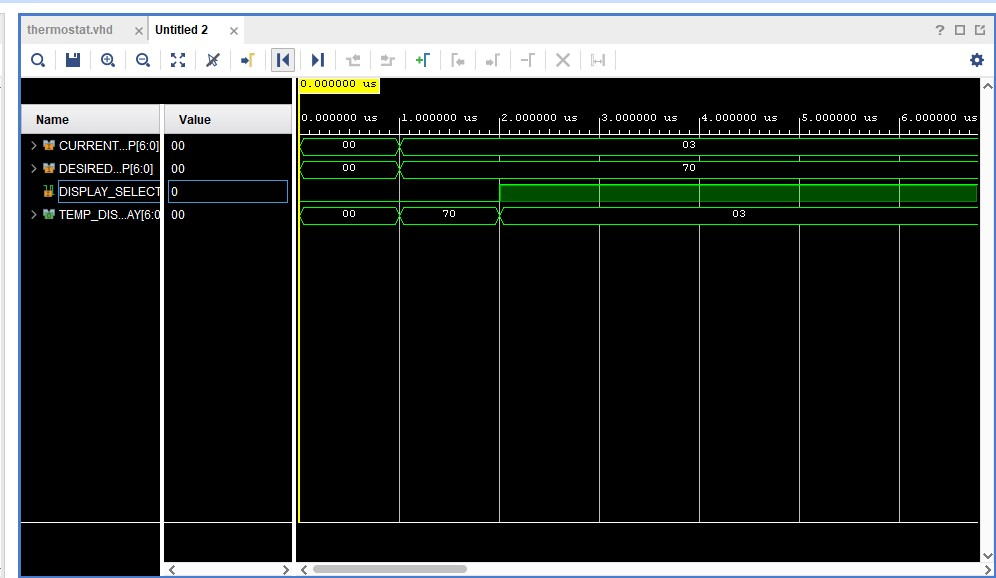

# Lab 1 – Waveform Analysis

## Input Values
For this simulation, I set:
- `CURRENT_TEMP = 0000011₂ = 03₁₆`
- `DESIRED_TEMP = 1110000₂ = 70₁₆`

## Timing Results
- At **0–2 µs**, `DISPLAY_SELECT = 0`  
  → Output `TEMP_DISPLAY = DESIRED_TEMP = 70₁₆`

- At **2+ µs**, `DISPLAY_SELECT = 1`  
  → Output `TEMP_DISPLAY = CURRENT_TEMP = 03₁₆`

## Notes
- Vivado saves the waveform configuration in `waveform.xd`  
- Hexadecimal is shown by default (`03`, `70`), but you can switch radix to binary in the simulator to view bit patterns directly.  
