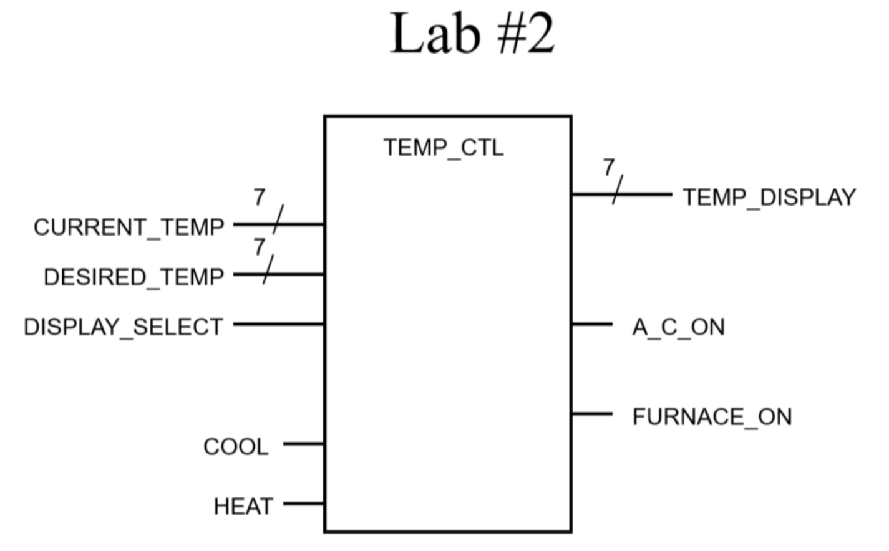

# Lab 2 – Add Logic to Thermostat (A/C and Furnace Control)

This lab extends **Lab 1 – Basic Multiplexer** by adding logic to control the **Air Conditioner (A/C)** and **Furnace**.

In addition to displaying the current or desired temperature, the system now decides whether to turn ON the A/C or Furnace based on temperature comparison and manual control bits.

---

## Inputs

* `CURRENT_TEMP` (7-bit vector) – measured temperature
* `DESIRED_TEMP` (7-bit vector) – user-set temperature
* `DISPLAY_SELECT` (1 bit) – choose which temperature to display
* `COOL` (1 bit) – manual enable for A/C
* `HEAT` (1 bit) – manual enable for Furnace

## Outputs

* `TEMP_DISPLAY` (7-bit vector) – shows current or desired temperature
* `A_C_ON` (1 bit) – A/C control output
* `FURNACE_ON` (1 bit) – Furnace control output

---

## Logic Description

* If `(DESIRED_TEMP < CURRENT_TEMP) AND (COOL = '1')` → **A/C ON**
* If `(DESIRED_TEMP > CURRENT_TEMP) AND (HEAT = '1')` → **Furnace ON**
* Otherwise → both OFF

---

## Truth Table

| Desired vs Current | COOL | HEAT | A/C ON | Furnace ON |
| ------------------ | ---- | ---- | ------ | ---------- |
| `<` (less)         | 0    | 0    | OFF    | OFF        |
| `<` (less)         | 0    | 1    | OFF    | OFF        |
| `<` (less)         | 1    | 0    | ON     | OFF        |
| `<` (less)         | 1    | 1    | ON     | OFF        |
| `>` (greater)      | 0    | 0    | OFF    | OFF        |
| `>` (greater)      | 0    | 1    | OFF    | ON         |
| `>` (greater)      | 1    | 0    | OFF    | OFF        |
| `>` (greater)      | 1    | 1    | OFF    | ON         |

*(When Desired = Current, both A/C and Furnace remain OFF regardless of COOL/HEAT.)*

---

## Block Diagram

