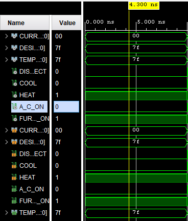
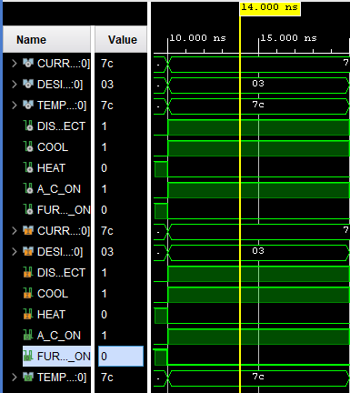
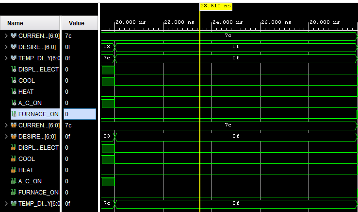
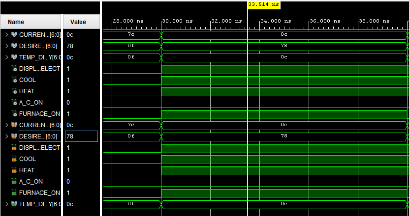
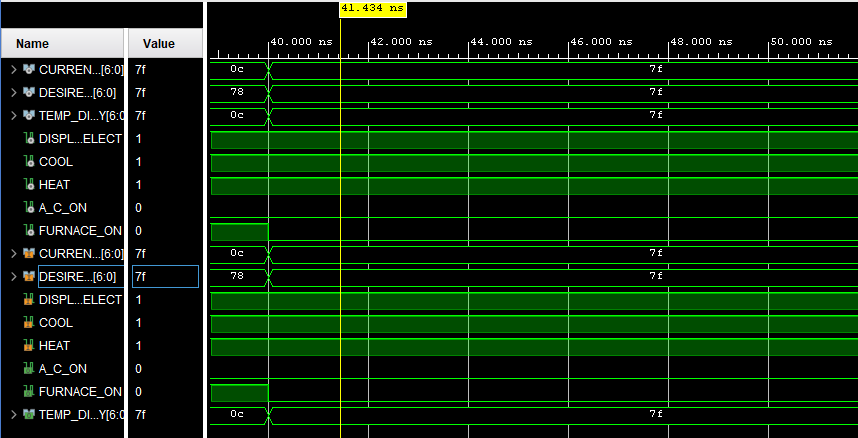

# Lab 2 – Waveform Results

This document shows the simulation results for **Lab 2 – Add Logic to Thermostat**.
Each test case is applied for 10 ns. For each case, two images are provided:

* Signal values at that time interval
* Corresponding waveform view

---

## Test Case 1 (0–10 ns)

* **CURRENT_TEMP = `0000000` (0)**
* **DESIRED_TEMP = `1111111` (127)**
* **DISPLAY_SELECT = 0 → TEMP_DISPLAY shows DESIRED_TEMP**
* **COOL = 0, HEAT = 1**
* **Expected: A_C_ON = 0, FURNACE_ON = 1**

**Signal values+waveform:**

---

## Test Case 2 (10–20 ns)

* **CURRENT_TEMP = `1111100` (124)**
* **DESIRED_TEMP = `0000011` (3)**
* **DISPLAY_SELECT = 1 → TEMP_DISPLAY shows CURRENT_TEMP**
* **COOL = 1, HEAT = 0**
* **Expected: A_C_ON = 1, FURNACE_ON = 0**

**Signal values:**

**Waveform:**

---

## Test Case 3 (20–30 ns)

* **CURRENT_TEMP = `1111100` (124)**
* **DESIRED_TEMP = `0001111` (15)**
* **DISPLAY_SELECT = 0 → TEMP_DISPLAY shows DESIRED_TEMP**
* **COOL = 0, HEAT = 0**
* **Expected: A_C_ON = 0, FURNACE_ON = 0**

**Signal values:**

**Waveform:**

---

## Test Case 4 (30–40 ns)

* **CURRENT_TEMP = `0001100` (12)**
* **DESIRED_TEMP = `1111000` (120)**
* **DISPLAY_SELECT = 1 → TEMP_DISPLAY shows CURRENT_TEMP**
* **COOL = 1, HEAT = 1**
* **Expected: A_C_ON = 0, FURNACE_ON = 1**

**Signal values:**

**Waveform:**

---

## Test Case 5 (40–50 ns, edge case)

* **CURRENT_TEMP = `1111111` (127)**
* **DESIRED_TEMP = `1111111` (127)**
* **DISPLAY_SELECT = 1 → TEMP_DISPLAY shows CURRENT_TEMP**
* **COOL = 1, HEAT = 1**
* **Expected: A_C_ON = 0, FURNACE_ON = 0**

**Signal values:**

**Waveform:**

---

👉 You just need to replace each `![Values Case X]` and `![Waveform Case X]` with the **real screenshots** you save in your `images` folder.

---

Do you want me to also make you a **file naming convention** for your screenshots (like `case1_values.png`, `case1_waveform.png`, etc.) so everything stays super organized in GitHub?
