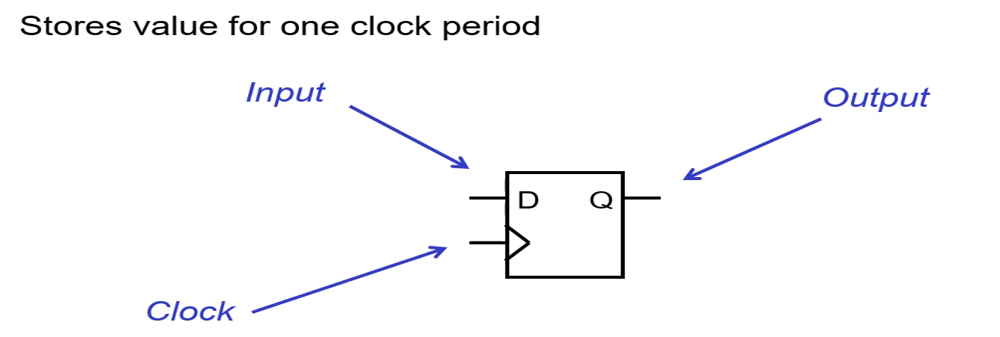
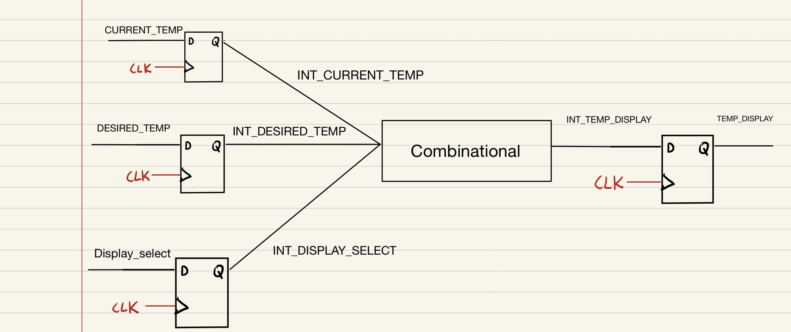
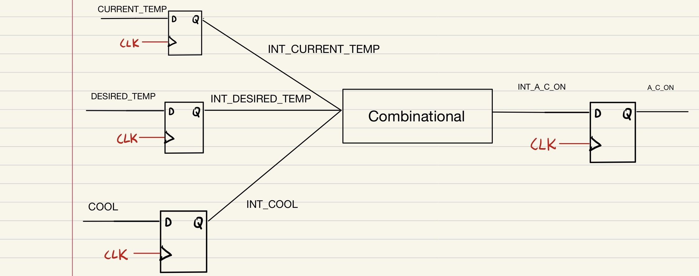
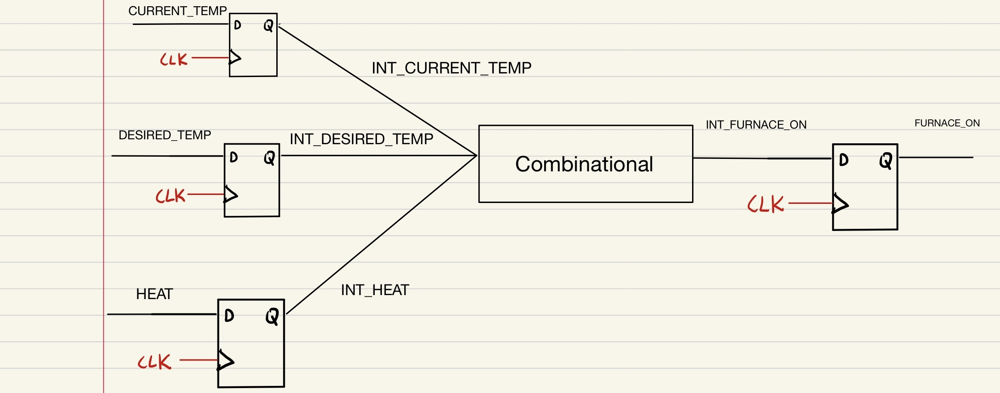

# Lab 3 – Add Flip-Flops to Thermostat (Registered Inputs and Outputs)

This lab extends **Lab 1 – Basic Multiplexer** and **Lab 2 – Add Logic** by introducing **flip-flops**.
Flip-flops are used to register both the inputs and the outputs, ensuring that all signals are synchronized with a common clock and reset.

---

## What is a Flip-Flop?

A **flip-flop** is a simple memory element with three main ports:

* **Input (D)** – the value to be stored
* **Clock (CLK)** – controls when the input is sampled
* **Output (Q)** – holds the stored value

Operation:

* At the **rising edge of the clock** (when the clock changes from `0` → `1`), the output `Q` is updated to match the input `D`.
* Between clock edges, the output remains unchanged, even if the input changes.

This behavior allows flip-flops to **synchronize signals** and **prevent glitches**, since outputs only change at specific clock edges.

---
## Mission – Register Inputs and Outputs

In this lab, the goal is to **register all inputs and outputs** of the thermostat design.

* **Inputs (CURRENT_TEMP, DESIRED_TEMP, DISPLAY_SELECT, COOL, HEAT)** are first passed through flip-flops.
  This ensures that all signals are synchronized to the clock and only update on the **rising edge**.

* After the inputs are registered, the logic computations are performed (temperature comparison, display selection, A/C and Furnace control).

* **Outputs (TEMP_DISPLAY, A_C_ON, FURNACE_ON)** are also passed through flip-flops before leaving the module.
  This guarantees that outputs change only on the rising edge of the clock, preventing glitches and keeping timing predictable.

To test the design, the **testbench generates a clock** (with a fixed period) and a **reset signal**.

* When reset = `0`, all flip-flops are cleared (set to `0`).
* When reset = `1`, flip-flops operate normally, capturing inputs and producing outputs at each clock edge.

This structure makes the circuit behave in a fully synchronous way:
➡️ **Inputs are sampled only at clock edges**
➡️ **Outputs update only at clock edges**

Nice 👌 you’ve got the diagrams to make the README super clear.
We can structure this part of **Lab 3 README** like this:

---

## Design Structure

To make the system easier to understand, we can break it into **three main parts**, each responsible for one function of the thermostat.

### Part 1 – Temperature Display Path

* Inputs: `CURRENT_TEMP`, `DESIRED_TEMP`, `DISPLAY_SELECT`
* Each input is first registered into internal signals:

  * `INT_CURRENT_TEMP`
  * `INT_DESIRED_TEMP`
  * `INT_DISPLAY_SELECT`
* Combinational logic selects between current or desired temperature.
* The selected value (`INT_TEMP_DISPLAY`) is then stored into an output flip-flop → `TEMP_DISPLAY`.

 

---

### Part 2 – Air Conditioner Path

* Inputs: `CURRENT_TEMP`, `DESIRED_TEMP`, `COOL`
* Registered into internal signals:

  * `INT_CURRENT_TEMP`
  * `INT_DESIRED_TEMP`
  * `INT_COOL`
* Combinational logic decides if A/C should turn on.
* Result (`INT_A_C_ON`) is stored into an output flip-flop → `A_C_ON`.

 

---

### Part 3 – Furnace Path

* Inputs: `CURRENT_TEMP`, `DESIRED_TEMP`, `HEAT`
* Registered into internal signals:

  * `INT_CURRENT_TEMP`
  * `INT_DESIRED_TEMP`
  * `INT_HEAT`
* Combinational logic decides if Furnace should turn on.
* Result (`INT_FURNACE_ON`) is stored into an output flip-flop → `FURNACE_ON`.

 

---

👉 This makes it clear that **every path** follows the same principle:
**Inputs → Flip-Flops → Combinational Logic → Flip-Flops → Outputs**
