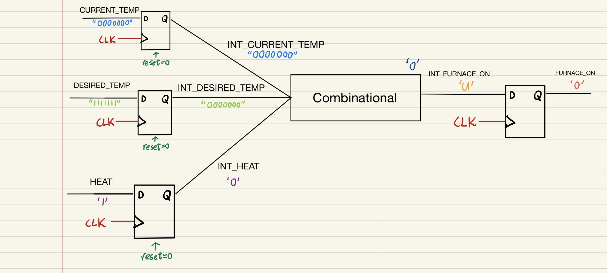

# Waveform Analysis
### Full Waveform View


The clock is generated with a **10 ns period**.  
- For the first **5 ns**, the clock is `'0'`.  
- For the next **5 ns**, the clock is `'1'`.  
- This creates a **rising edge** at every 5 ns, where flip-flops will update their outputs.  

The **reset signal** is also tested:  
- From **0–10 ns**, `RESET = 0`, forcing all flip-flop outputs to `'0'` (or `"0000000"` for vectors).  
- After **10 ns**, `RESET = 1`, so flip-flops behave normally and capture inputs at each rising edge.

We will now analyze the outputs step by step at specific time points (5 ns, 15 ns, 25 ns, etc.).

---
## At 5 ns


At 5 ns, the **clock has its first rising edge**.
Since `RESET = 0` during this time, all flip-flops are forced to **reset state**.

---

### Path 1 – Temperature Display


* `CURRENT_TEMP = 0000000`, but reset forces → `INT_CURRENT_TEMP = 0000000`
* `DESIRED_TEMP = 1111111`, but reset forces → `INT_DESIRED_TEMP = 0000000`
* `DISPLAY_SELECT = 0`, but reset forces → `INT_DISPLAY_SELECT = 0`
* Combinational logic selects `INT_TEMP_DISPLAY = 0000000`
* At the same time, the TEMP_DISPLAY flip-flop is checking its input → sees U (undefined, because nothing stable yet)
* Reset is active → output forced to TEMP_DISPLAY = `0000000`
---

### Path 2 – Air Conditioner (A_C_ON)


* `COOL = 0`, reset forces → `INT_COOL = 0`
* Comparison logic → `INT_A_C_ON = 0`
* At the same time, the A_C_ON flip-flop is checking its input → sees U (undefined, not yet valid)
* Reset is active → output forced to A_C_ON = `0`

---

### Path 3 – Furnace (FURNACE_ON)



* `HEAT = 1`, but reset forces → `INT_HEAT = 0`
* Comparison logic → `INT_FURNACE_ON = 0`
*At the same time, the FURNACE_ON flip-flop is checking its input → sees U (undefined, not yet valid)
*Reset is active → output forced to FURNACE_ON = `0`

---

### Summary

```
TEMP_DISPLAY = 0000000
A_C_ON       = 0
FURNACE_ON   = 0
```
---
