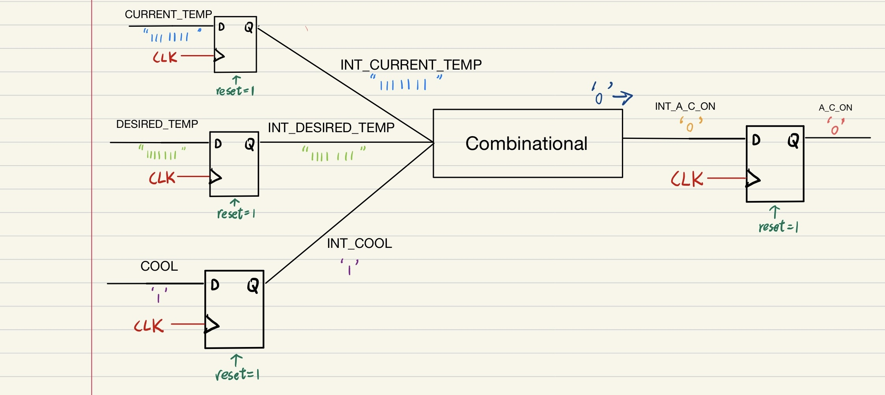

# Waveform Analysis
### Full Waveform View


The clock is generated with a **10 ns period**.  
- For the first **5 ns**, the clock is `'0'`.  
- For the next **5 ns**, the clock is `'1'`.  
- This creates a **rising edge** at every 5 ns, where flip-flops will update their outputs.  

The **reset signal** is also tested:  
- From **0–10 ns**, `RESET = 0`, forcing all flip-flop outputs to `'0'` (or `"0000000"` for vectors).  
- After **10 ns**, `RESET = 1`, so flip-flops behave normally and capture inputs at each rising edge.

We will now analyze the outputs step by step at specific time points (5 ns, 15 ns, 25 ns, etc.).

---
## At 5 ns


At 5 ns, the **clock has its first rising edge**.
Since `RESET = 0` during this time, all flip-flops are forced to **reset state**.

---

### Path 1 – Temperature Display


* `CURRENT_TEMP = 0000000`, but reset forces → `INT_CURRENT_TEMP = 0000000`
* `DESIRED_TEMP = 1111111`, but reset forces → `INT_DESIRED_TEMP = 0000000`
* `DISPLAY_SELECT = 0`, but reset forces → `INT_DISPLAY_SELECT = 0`
* Combinational logic selects `INT_TEMP_DISPLAY = 0000000`
* At the same time, the TEMP_DISPLAY flip-flop is checking its input → sees U (undefined, because nothing stable yet)
* Reset is active → output forced to TEMP_DISPLAY = `0000000`
---

### Path 2 – Air Conditioner (A_C_ON)


* `COOL = 0`, reset forces → `INT_COOL = 0`
* Comparison logic → `INT_A_C_ON = 0`
* At the same time, the A_C_ON flip-flop is checking its input → sees U (undefined, not yet valid)
* Reset is active → output forced to A_C_ON = `0`

---

### Path 3 – Furnace (FURNACE_ON)


* `HEAT = 1`, but reset forces → `INT_HEAT = 0`
* Comparison logic → `INT_FURNACE_ON = 0`
*At the same time, the FURNACE_ON flip-flop is checking its input → sees U (undefined, not yet valid)
*Reset is active → output forced to FURNACE_ON = `0`

---

### Summary

```
TEMP_DISPLAY = 0000000
A_C_ON       = 0
FURNACE_ON   = 0
```
---
# At 15 ns


At 15 ns, the **clock has a rising edge**.
Now `RESET = 1`, so all flip-flops behave **normally** (not forced to zero).

---

### Path 1 – Temperature Display


* `CURRENT_TEMP = 1111100` → updates → `INT_CURRENT_TEMP = 1111100`
* `DESIRED_TEMP = 0000011` → updates → `INT_DESIRED_TEMP = 0000011`
* `DISPLAY_SELECT = 1` → updates → `INT_DISPLAY_SELECT = 1`
* Combinational logic chooses `INT_TEMP_DISPLAY = INT_CURRENT_TEMP = 1111100`
* At the same time, the TEMP_DISPLAY flip-flop is checking its input `0000000` (old value) while the combinational block just generated `1111100.`
  output remains TEMP_DISPLAY = `0000000` (still holding old reset value, will update next cycle)

---

### Path 2 – Air Conditioner (A_C_ON)


* `COOL = 1` → updates → `INT_COOL = 1`
* Comparison logic checks: `INT_DESIRED_TEMP (0000011) < INT_CURRENT_TEMP (1111100)` AND `INT_COOL = 1`
  → so `INT_A_C_ON = 1`
* At the same time, the A_C_ON flip-flop is checking its input `0` (old value) while the combinational block just generated `1`.
  output remains A_C_ON = `0` (still holding old reset value, will update next cycle)

---

### Path 3 – Furnace (FURNACE_ON)


* `HEAT = 0` → updates → `INT_HEAT = 0`
* Comparison logic checks: `INT_DESIRED_TEMP (0000011) > INT_CURRENT_TEMP (1111100)` AND `INT_HEAT = 1`
  → false, so `INT_FURNACE_ON = 0`
* At the same time, the FURNACE_ON flip-flop is checking its input `0` (old value) while the combinational block just generated `0`.
  output remains FURNACE_ON = `0` (still holding old reset value)

---

### Summary

```
TEMP_DISPLAY = 0000000   (still old value, updates next cycle)
A_C_ON       = 0         (combinational = 1, but output register holds old)
FURNACE_ON   = 0         (combinational = 0, output register also 0)
```

---
# At 25 ns


At 25 ns, the **clock has another rising edge**.
Since `RESET = 1`, all flip-flops operate **normally**.

---

### Path 1 – Temperature Display


* `CURRENT_TEMP = 1111100` → updates → `INT_CURRENT_TEMP = 1111100`
* `DESIRED_TEMP = 0001111` → updates → `INT_DESIRED_TEMP = 0001111`
* `DISPLAY_SELECT = 0` → updates → `INT_DISPLAY_SELECT = 0`
* Combinational logic chooses `INT_TEMP_DISPLAY = INT_DESIRED_TEMP = 0001111`
* At the same time, the TEMP_DISPLAY flip-flop is checking its input `1111100` (old value from previous cycle) while the combinational block just generated `0001111`.
  → output remains TEMP_DISPLAY = `1111100` (still holding old value, will update next cycle)

---

### Path 2 – Air Conditioner (A_C_ON)


* `COOL = 0` → updates → `INT_COOL = 0`
* Comparison logic checks: `INT_DESIRED_TEMP (0001111) < INT_CURRENT_TEMP (1111100)` AND `INT_COOL = 0`
  → false, so `INT_A_C_ON = 0`
* At the same time, the A_C_ON flip-flop is checking its input `1` (old value from previous cycle) while the combinational block just generated `0`.
  → output remains A_C_ON = `1` (still holding old value, will update next cycle)

---

### Path 3 – Furnace (FURNACE_ON)


* `HEAT = 0` → updates → `INT_HEAT = 0`
* Comparison logic checks: `INT_DESIRED_TEMP (0000111) > INT_CURRENT_TEMP (1111100)` AND `INT_HEAT = 1`
  → false, so `INT_FURNACE_ON = 0`
* At the same time, the FURNACE_ON flip-flop is checking its input `0` (old value) while the combinational block just generated `0`.
  → output remains FURNACE_ON = `0` (no change)

---

### Summary

```
TEMP_DISPLAY = 1111100   (still old value, new = 0000111 will update next cycle)
A_C_ON       = 1         (combinational = 0, but output holds old 1)
FURNACE_ON   = 0         (combinational = 0, output register also 0)
```

---
# At 35 ns


At 35 ns, the **clock has another rising edge**.
`RESET = 1`, so flip-flops work **normally**.

---

### Path 1 – Temperature Display


* `CURRENT_TEMP = 0001100` → updates → `INT_CURRENT_TEMP = 0001100`
* `DESIRED_TEMP = 1111000` → updates → `INT_DESIRED_TEMP = 1111000`
* `DISPLAY_SELECT = 1` → updates → `INT_DISPLAY_SELECT = 1`
* Combinational logic chooses: `INT_TEMP_DISPLAY = INT_CURRENT_TEMP = 0001100`
* At the same time, the TEMP_DISPLAY flip-flop is checking its input `0001111` (old value) while the combinational block just generated `0001100`.
  Output remains TEMP_DISPLAY = `0001111` (still holding old value, will update next cycle)

---

### Path 2 – Air Conditioner (A_C_ON)


* `COOL = 1` → updates → `INT_COOL = 1`
* Logic check: `INT_DESIRED_TEMP (1111000) < INT_CURRENT_TEMP (0001100)`? → **false**
  So combinational result = `0`
* At the same time, the A_C_ON flip-flop is checking its input `0` (old value) while the combinational block just generated `0`.
  Output remains A_C_ON = `0`

---

### Path 3 – Furnace (FURNACE_ON)


* `HEAT = 1` → updates → `INT_HEAT = 1`
* Logic check: `INT_DESIRED_TEMP (1111000) > INT_CURRENT_TEMP (0001100)` AND `INT_HEAT = 1` → **true**
  So combinational result = `1`
* At the same time, the FURNACE_ON flip-flop is checking its input `0` (old value) while the combinational block just generated `1`.
  Output remains FURNACE_ON = `0` (will update next cycle)

---

### Summary

```
TEMP_DISPLAY = 0001111   (old value, updates next cycle)
A_C_ON       = 0
FURNACE_ON   = 0         (combinational = 1, but flip-flop still holds old 0)
```
---
# At 45 ns

At 45 ns, the **clock has a rising edge**.
`RESET = 1`, so flip-flops behave **normally**.

---

### Path 1 – Temperature Display


* `CURRENT_TEMP = 1111111` → updates → `INT_CURRENT_TEMP = 1111111`
* `DESIRED_TEMP = 1111111` → updates → `INT_DESIRED_TEMP = 1111111`
* `DISPLAY_SELECT = 1` → updates → `INT_DISPLAY_SELECT = 1`
* Combinational logic chooses `INT_TEMP_DISPLAY = INT_CURRENT_TEMP = 1111111`
* At the same time, the TEMP_DISPLAY flip-flop is checking its input `0001100` (old value) while the combinational block just generated `1111111`.
  → Output remains TEMP_DISPLAY = `0001100` (still holding old value, will update next cycle).

---

### Path 2 – Air Conditioner (A_C_ON)



* `COOL = 1` → updates → `INT_COOL = 1`
* Comparison logic:
  `INT_DESIRED_TEMP (1111111) < INT_CURRENT_TEMP (1111111)`? → **False**
  So `INT_A_C_ON = 0`
* At the same time, the A_C_ON flip-flop is checking its input `0` (old value) while combinational produced `0`.
  → Output remains A_C_ON = `0`.

---

### Path 3 – Furnace (FURNACE_ON)


* `HEAT = 1` → updates → `INT_HEAT = 1`
* Comparison logic:
  `INT_DESIRED_TEMP (1111111) > INT_CURRENT_TEMP (1111111)`? → **False**
  So `INT_FURNACE_ON = 0`
* At the same time, the FURNACE_ON flip-flop is checking its input `1` (old value) while combinational produced `0`.
  → Output remains FURNACE_ON = `1` (still holding old value, will update next cycle).

---

### Summary

```
TEMP_DISPLAY = 0001100   (old value, updates next cycle)
A_C_ON       = 0         (combinational = 0, output register also 0)
FURNACE_ON   = 1         (combinational = 0, but output register still 1)
```

---
# At 55 ns


At 55 ns, the **clock has another rising edge**.
`RESET = 1`, so all flip-flops behave **normally**.

---

### Path 1 – Temperature Display


* `CURRENT_TEMP = 1111111` → updates → `INT_CURRENT_TEMP = 1111111`
* `DESIRED_TEMP = 1111111` → updates → `INT_DESIRED_TEMP = 1111111`
* `DISPLAY_SELECT = 1` → updates → `INT_DISPLAY_SELECT = 1`
* Combinational logic chooses `INT_TEMP_DISPLAY = INT_CURRENT_TEMP = 1111111`
* At the same time, the TEMP_DISPLAY flip-flop is checking its input `1111111` while the combinational block just generated the same new value.
  → Output remains `TEMP_DISPLAY = 1111111` (still holding previous cycle’s value, will fully sync on next cycle).

---

### Path 2 – Air Conditioner (A_C_ON)


* `COOL = 1` → updates → `INT_COOL = 1`
* Comparison logic checks: `INT_DESIRED_TEMP (1111111) < INT_CURRENT_TEMP (1111111)` → false.
  → So `INT_A_C_ON = 0`.
* At the same time, the A_C_ON flip-flop is checking its input `0` while the combinational block also gives `0`.
  → Output remains A_C_ON = `0`.

---

### Path 3 – Furnace (FURNACE_ON)


* `HEAT = 1` → updates → `INT_HEAT = 1`
* Comparison logic checks: `INT_DESIRED_TEMP (1111111) > INT_CURRENT_TEMP (1111111)` → false.
  → So `INT_FURNACE_ON = 0`.
* At the same time, the FURNACE_ON flip-flop is checking its input `0` while the combinational block also gives `0`.
  → Output remains FURNACE_ON = `0`.

---

### Summary

```
TEMP_DISPLAY = 1111111
A_C_ON       = 0
FURNACE_ON   = 0
```

---
