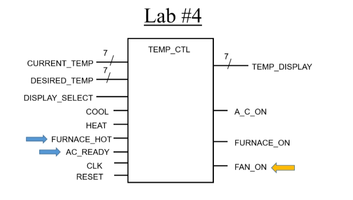
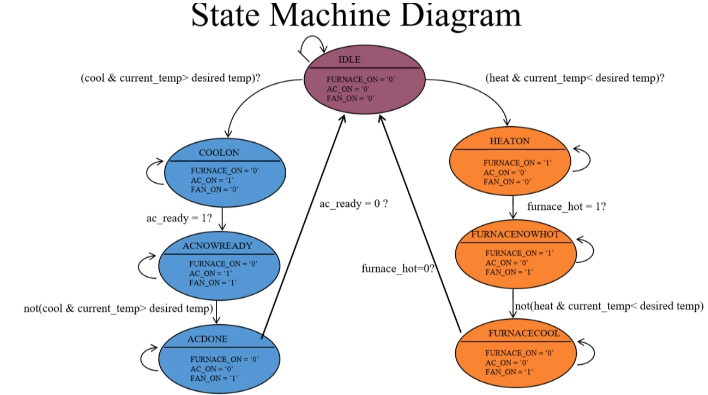

# Lab 4 – Add State Machine to Thermostat

This lab extends **Lab 3 – Registered Inputs and Outputs** by introducing a **Finite State Machine (FSM)**.
The FSM is responsible for controlling the Air Conditioner (A/C), Furnace, and Fan based on the current temperature, desired temperature, and new control signals.

---

## What is a State Machine?

A **state machine** is a digital circuit that remembers its current mode of operation (state) and changes to a new state depending on the inputs and transition conditions.

It consists of:

* **Flip-flops** – used to store the **current state** (updated only on the rising clock edge).
* **Transition logic** – checks the inputs/conditions and decides the **next state**.
* **Output logic** – determines the outputs (`A_C_ON`, `FURNACE_ON`, `FAN_ON`) depending on the current state.

This means:

* The FSM **remembers** where it is (current state).
* On each clock edge, if the inputs match a condition, it **jumps to the next state**.
* Outputs are updated according to the state.

---

## Mission – Extend Thermostat with FSM

The Lab 4 thermostat system adds two new input signals (`FURNACE_HOT`, `AC_READY`) and one new output (`FAN_ON`).  
These signals extend the Lab 3 design and allow us to implement the finite state machine (FSM).  

In this lab, we extend the thermostat design with:

* New **inputs**:

  * `FURNACE_HOT` → becomes high when the furnace is heated up.
  * `AC_READY` → becomes high when the A/C is ready to blow air.

* New **output**:

  * `FAN_ON` → turns on when either the Furnace is hot or the A/C is ready.

* A **state machine** that controls the system:

  * **IDLE** → all devices off.
  * **COOLON → ACNOWREADY → ACDONE** for cooling cycle.
  * **HEATON → FURNACENOWHOT → FURNACECOOL** for heating cycle.

The FSM checks whether the current temperature is higher or lower than the desired temperature and uses the `HEAT` / `COOL` requests, along with `FURNACE_HOT` and `AC_READY`, to transition between states.

---

## State Diagram

The target mission of this lab is to design the **state diagram** for the thermostat FSM.

The FSM has 7 states:  
- **IDLE**  
- **HEATON**  
- **FURNACENOWHOT**  
- **FURNACECOOL**  
- **COOLON**  
- **ACNOWREADY**  
- **ACDONE**

Transitions are determined by the conditions on `CURRENT_TEMP`, `DESIRED_TEMP`, `HEAT`, `COOL`, `FURNACE_HOT`, and `AC_READY`.

---

## Implementation Notes

* All signals are converted to **`std_logic`** and **`std_logic_vector`** (instead of `bit`).
* Inputs (`CURRENT_TEMP`, `DESIRED_TEMP`, `DISPLAY_SELECT`, `COOL`, `HEAT`) are still passed through flip-flops.
* The FSM flip-flop stores the **current state**, which updates only on the rising clock edge.
* Outputs (`A_C_ON`, `FURNACE_ON`, `FAN_ON`) are determined solely by the **current state**.

---
