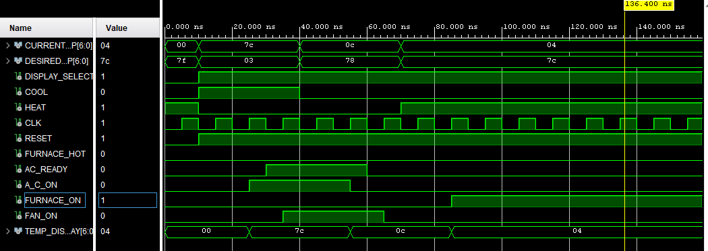
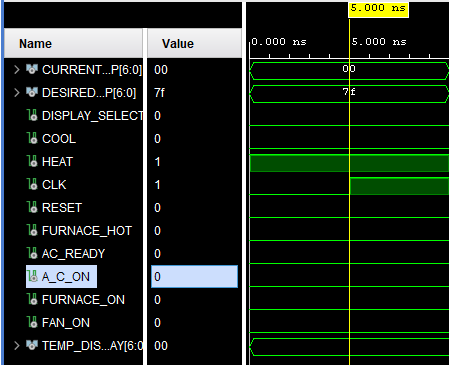
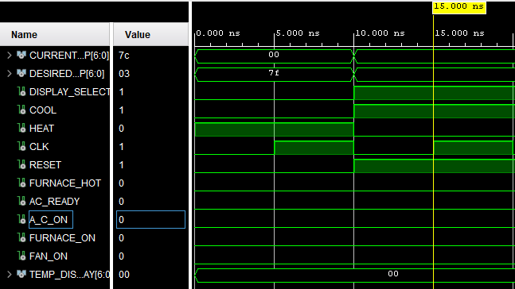
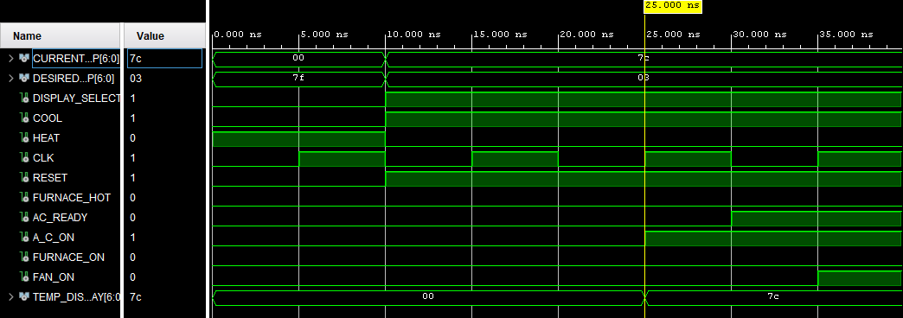
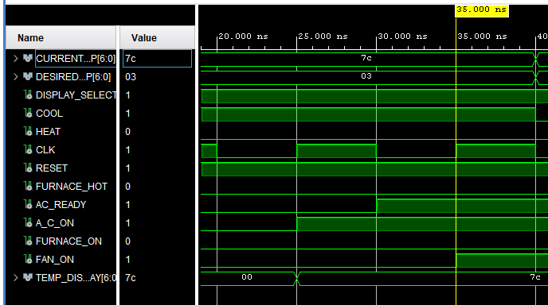
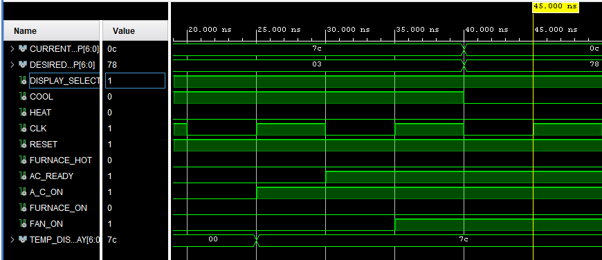
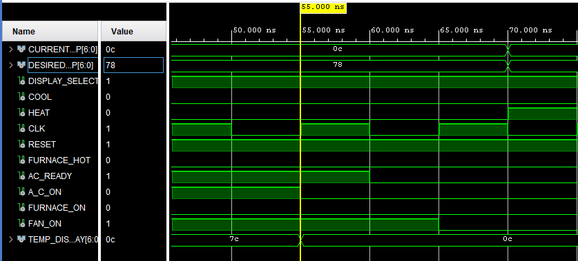
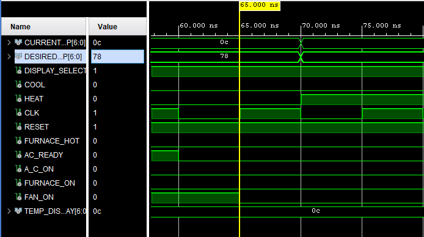
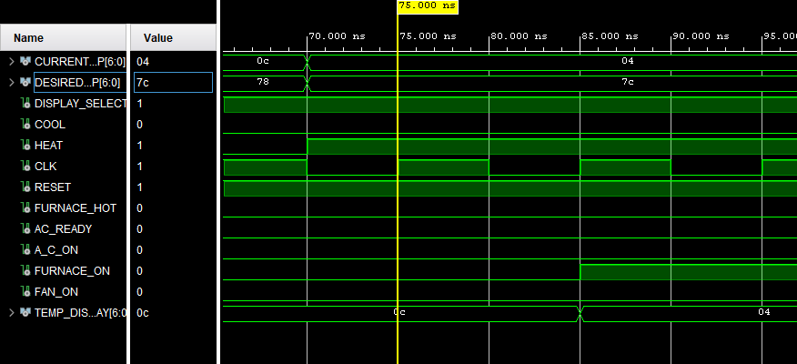
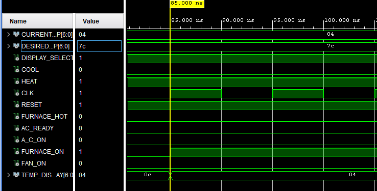

# Waveform Analysis (Lab 4 – State Machine)

## Full Waveform View



The clock is generated with a **10 ns period**:

* First 5 ns → `CLK = '0'`
* Next 5 ns → `CLK = '1'`
* Creates a rising edge every 10 ns.

The **reset signal** forces all flip-flops into the **IDLE state** when `RESET = '0'`.
After reset is released (`RESET = '1'`), the FSM starts updating states at each rising edge.

---

## State Machine Operation

* In this lab, all **inputs** (`CURRENT_TEMP`, `DESIRED_TEMP`, `COOL`, `HEAT`) are first passed through **flip-flops**, producing registered signals (`INT_CURRENT_TEMP`, `INT_DESIRED_TEMP`, `INT_COOL`, `INT_HEAT`).
* The **combinational logic** computes `NEXT_STATE` from these registered signals.
* On each **clock rising edge**, the `CURRENT_STATE` flip-flop updates to hold `NEXT_STATE`.
* This introduces a **one-cycle delay**: outputs reflect the logic **one clock later**.

---

## Example State Transitions

### At 5 ns (Reset Active – IDLE)



At 5 ns, the clock has its **first rising edge**. Since `RESET = '0'`, all flip-flops are forced into their reset state:

* `CURRENT_TEMP = 0000000`, but reset forces → **`INT_CURRENT_TEMP = 0000000`**
* `DESIRED_TEMP = 1111111`, but reset forces → **`INT_DESIRED_TEMP = 0000000`**
* `COOL = 0`, reset forces → **`INT_COOL = 0`**

  * Comparison logic sees `INT_DESIRED_TEMP < INT_CURRENT_TEMP` = false → **`INT_A_C_ON = 0`**
  * At the same time, the **A_C_ON flip-flop** is checking its input → sees *U* (undefined, not yet valid).
  * Reset is active → output forced to **`A_C_ON = 0`**.
* `HEAT = 1`, but reset forces → **`INT_HEAT = 0`**

  * Comparison logic sees `INT_DESIRED_TEMP > INT_CURRENT_TEMP` = false → **`INT_FURNACE_ON = 0`**
  * At the same time, the **FURNACE_ON flip-flop** is checking its input → sees *U* (undefined).
  * Reset is active → output forced to **`FURNACE_ON = 0`**.
* `FAN_ON = 0` (reset default).

Because reset forces the FSM into **IDLE**, and none of the conditions match, the system stays in the **IDLE state**.

### Summary

```text
STATE        = IDLE
A_C_ON       = 0
FURNACE_ON   = 0
FAN_ON       = 0
```
---
## At 15 ns (Reset Released – Still IDLE)



At 15 ns, the clock has a rising edge and `RESET = '1'`. Now the input flip-flops start updating with the testbench values:

* `CURRENT_TEMP = 1111100` → updates → `INT_CURRENT_TEMP = 1111100`
* `DESIRED_TEMP = 0000011` → updates → `INT_DESIRED_TEMP = 0000011`
* `COOL = 1` → updates → `INT_COOL = 1`
* `HEAT = 0` → updates → `INT_HEAT = 0`

Combinational logic checks:

* Cooling: `INT_DESIRED_TEMP (0000011) < INT_CURRENT_TEMP (1111100)` and `INT_COOL = 1` → **true**, so `INT_A_C_ON = 1`.
* Heating: `INT_DESIRED_TEMP (0000011) > INT_CURRENT_TEMP (1111100)` and `INT_HEAT = 1` → **false**, so `INT_FURNACE_ON = 0`.

But at the same moment, the **output flip-flops** (`A_C_ON`, `FURNACE_ON`) are still holding the *old values* from reset (both = 0).
They will update on the **next clock cycle**.

Therefore, the FSM remains in the **IDLE state** at this time.

### Summary

```text
STATE        = IDLE
A_C_ON       = 0   (next cycle → 1)
FURNACE_ON   = 0
FAN_ON       = 0
```
---

Got it 👍. At **25 ns**, we’ll clearly show that the FSM has transitioned from **IDLE → COOLON**, because the registered inputs met the condition (`COOL=1` and `CURRENT_TEMP > DESIRED_TEMP`). This time the **A_C_ON flip-flop actually updates to 1**. Let’s write it in the same style:

---

## At 25 ns (Transition to COOLON)



At 25 ns, another clock rising edge occurs (`RESET = '1'`). The state machine now checks the registered inputs:

* `INT_CURRENT_TEMP = 1111100`
* `INT_DESIRED_TEMP = 0000011`
* `INT_COOL = 1`
* `INT_HEAT = 0`

FSM transition logic:

* Since `INT_COOL = 1` **and** `INT_CURRENT_TEMP > INT_DESIRED_TEMP`, the FSM condition is satisfied → `NEXT_STATE = COOLON`.
* On this clock edge, `CURRENT_STATE` is updated to **COOLON**.

Outputs:

* From the state machine definition, in **COOLON**:

  * `A_C_ON <= '1'`
  * `FURNACE_ON <= '0'`
  * `FAN_ON <= '0'`

This is the first moment where the AC is officially ON, because both the **state** and the **output flip-flop** align.

---

### Summary

```text
STATE        = COOLON
A_C_ON       = 1
FURNACE_ON   = 0
FAN_ON       = 0
```

---

## At 35 ns (Transition to ACNOWREADY)



At 35 ns, the next clock rising edge occurs. Inputs are:

* `INT_CURRENT_TEMP = 1111100`
* `INT_DESIRED_TEMP = 0000011`
* `INT_COOL = 1`
* `INT_HEAT = 0`
* `AC_READY = 1` (external, not registered)

FSM transition logic:

* Current state before clock = **COOLON**
* Condition check: In COOLON, if `AC_READY = 1` → `NEXT_STATE = ACNOWREADY`
* On this clock edge, `CURRENT_STATE` is updated to **ACNOWREADY**

Outputs:

* From the FSM definition in **ACNOWREADY**:

  * `A_C_ON <= '1'`
  * `FURNACE_ON <= '0'`
  * `FAN_ON <= '1'`

The key difference here is that because `AC_READY` is asynchronous (not registered), as soon as it goes high, the FSM transitions into **ACNOWREADY** on the very next clock.

---

### Summary

```text
STATE        = ACNOWREADY
A_C_ON       = 1
FURNACE_ON   = 0
FAN_ON       = 1
```

---
## At 45 ns (Still in ACNOWREADY)



At 45 ns, the next clock rising edge occurs. Inputs are:

* `CURRENT_TEMP = 0001100` → updates → `INT_CURRENT_TEMP = 0001100`
* `DESIRED_TEMP = 1111000` → updates → `INT_DESIRED_TEMP = 1111000`
* `COOL = 0` → updates → `INT_COOL = 0`
* `HEAT = 0` → updates → `INT_HEAT = 0`

FSM transition logic:

* Current state before clock = **ACNOWREADY**
* Condition check for ACNOWREADY:

  * Rule = *if `INT_COOL = 0` OR `INT_CURRENT_TEMP < INT_DESIRED_TEMP` → go to ACDONE*
  * At this instant, combinationally, `NEXT_STATE = ACDONE`
* But — at **this clock edge**, the FSM flip-flop is still holding **ACNOWREADY** (because the update to CURRENT_STATE happens after the evaluation).

Outputs:

* From the FSM definition in **ACNOWREADY**:

  * `A_C_ON <= '1'`
  * `FURNACE_ON <= '0'`
  * `FAN_ON <= '1'`

So even though the combinational logic is pointing to `NEXT_STATE = ACDONE`, the **actual outputs at 45 ns still reflect ACNOWREADY**. The transition will only be visible on the **next clock (55 ns)**.

---

### Summary

```text
STATE        = ACNOWREADY
A_C_ON       = 1
FURNACE_ON   = 0
FAN_ON       = 1
```

---
Perfect 👍 now let’s document the **55 ns case**, where the FSM finally updates from **ACNOWREADY → ACDONE**.

---

## At 55 ns (Transition to ACDONE)



At 55 ns, the next clock rising edge occurs. Inputs are still:

* `INT_CURRENT_TEMP = 0001100`
* `INT_DESIRED_TEMP = 1111000`
* `INT_COOL = 0`
* `INT_HEAT = 0`
* `AC_READY = 1` (external input, still high)

FSM transition logic:

* At the previous edge (45 ns), combinational logic had already decided `NEXT_STATE = ACDONE`.
* At this clock edge (55 ns), the FSM **updates CURRENT_STATE to ACDONE**.

Outputs:

* From the FSM definition in **ACDONE**:

  * `A_C_ON <= '0'` (AC turns OFF)
  * `FURNACE_ON <= '0'`
  * `FAN_ON <= '1'` (fan stays ON to finish the cooling cycle)

So now the system has officially completed the cooling cycle and is in the **ACDONE state**.

---

### Summary

```text
STATE        = ACDONE
A_C_ON       = 0
FURNACE_ON   = 0
FAN_ON       = 1
```
---

## At 65 ns (Transition to IDLE)



At 65 ns, another clock rising edge occurs. Inputs are:

* `INT_CURRENT_TEMP = 0001100`
* `INT_DESIRED_TEMP = 1111000`
* `INT_COOL = 0`
* `INT_HEAT = 0`
* `AC_READY = 0` (now updated low, external input)

FSM transition logic:

* Previous state was **ACDONE**.
* Condition check: In ACDONE, if `AC_READY = 0` → `NEXT_STATE = IDLE`.
* On this clock edge, `CURRENT_STATE` updates to **IDLE**.

Outputs:

* From the FSM definition in **IDLE**:

  * `A_C_ON <= '0'`
  * `FURNACE_ON <= '0'`
  * `FAN_ON <= '0'`

So the system is now fully reset to the **idle condition** with everything turned off.

---

### Summary

```text
STATE        = IDLE
A_C_ON       = 0
FURNACE_ON   = 0
FAN_ON       = 0
```

---
## At 75 ns (Still IDLE – Heating Pending)



At 75 ns, the clock has another rising edge. Inputs are:

* `CURRENT_TEMP = 0000100` → updates → `INT_CURRENT_TEMP = 0000100`
* `DESIRED_TEMP = 1111100` → updates → `INT_DESIRED_TEMP = 1111100`
* `HEAT = 1` → updates → `INT_HEAT = 1`
* `COOL = 0` → updates → `INT_COOL = 0`

FSM transition logic:

* Current state before clock = **IDLE**
* Condition check: In IDLE, if `INT_HEAT = 1` and `INT_CURRENT_TEMP < INT_DESIRED_TEMP` → `NEXT_STATE = HEATON`
* But at this edge, the FSM flip-flop still holds the old state → **CURRENT_STATE = IDLE**

Outputs:

* From the FSM definition in **IDLE**:

  * `A_C_ON <= '0'`
  * `FURNACE_ON <= '0'`
  * `FAN_ON <= '0'`

So although the logic has already set `NEXT_STATE = HEATON`, the system is still in **IDLE** at 75 ns. The actual transition to **HEATON** will happen at the **next rising edge (85 ns)**.

---

### Summary

```text
STATE        = IDLE
A_C_ON       = 0
FURNACE_ON   = 0
FAN_ON       = 0
```

---
## At 85 ns (Transition into HEATON)



At 85 ns, we hit the next rising edge of the clock. Here’s what happens:

* Registered inputs (`INT_`) are already holding:

  * `INT_CURRENT_TEMP = 0000100`
  * `INT_DESIRED_TEMP = 1111100`
  * `INT_HEAT = 1`
  * `INT_COOL = 0`

* FSM transition logic from previous cycle:

  * At 75 ns we evaluated **IDLE** → condition matched (`INT_HEAT=1` and `INT_CURRENT_TEMP < INT_DESIRED_TEMP`)
  * So `NEXT_STATE = HEATON`

* Now at 85 ns rising edge:

  * The FSM flip-flop updates `CURRENT_STATE <= NEXT_STATE`
  * Therefore **CURRENT_STATE becomes HEATON**

Outputs from FSM in HEATON:

* `FURNACE_ON <= '1'`
* `A_C_ON <= '0'`
* `FAN_ON <= '0'`

---

### Summary

```text
STATE        = HEATON
A_C_ON       = 0
FURNACE_ON   = 1
FAN_ON       = 0
```

---
