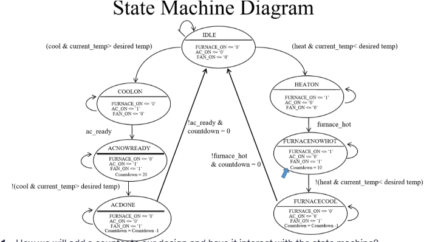

## 🧮 Lab 5 – Add Counter to Thermostat

This lab extends **Lab 4 – Finite State Machine (FSM)** by introducing **countdown timers** for both the **Air Conditioner (A/C)** and **Furnace** systems.
The goal is to simulate a *cool-down* or *heat-dissipation* period after each system finishes its operation, before returning to the **IDLE** state.

---

### 🔍 What’s New in This Lab

In Lab 5, we introduce:

* **Mathematical operations** (`+`, `-`) to decrement counters each clock cycle.
* A **custom VHDL package** (`math_package.vhd` and `math_package_body.vhd`) containing reusable functions:

  * `AC_COUNTDOWN(count : integer)`
  * `FN_COUNTDOWN(count : integer)`
    Each function reduces the counter value by 1 each clock cycle until 0.
* **Countdown signals** for both systems:

  * `countdown_ac : integer range 0 to 20 := 0`
  * `countdown_fn : integer range 0 to 20 := 0`

---

### ⚙️ Mission – Extend Thermostat with Counters

In **Lab 5**, the FSM logic is enhanced with timer-based transitions:

* When entering **`ACNOWREADY → ACDONE`**,
  the counter `countdown_ac` is **set to 20** and begins decrementing on each rising clock edge.
  When `countdown_ac = 0` *and* `AC_READY = 0`, the FSM returns to **IDLE**.

* Similarly, when entering **`FURNACENOWHOT → FURNACECOOL`**,
  the counter `countdown_fn` is **set to 10** and decrements until 0.
  When `countdown_fn = 0` *and* `FURNACE_HOT = 0`, the FSM transitions to **IDLE**.

This allows the fan (`FAN_ON`) to continue running for a short cool-down period after heating or cooling ends.

---

### 🧠 Updated State Diagram

The state diagram below shows the extended FSM with countdown behavior for both A/C and Furnace control:


---
### 🧮 Implementation of Countdown Function

To implement the **countdown behavior** for both the Air Conditioner (A/C) and Furnace, two functions were created inside the **`math_package`**:
`AC_COUNTDOWN()` and `FN_COUNTDOWN()`.

Each function takes the current counter value as input and subtracts 1 each clock cycle until it reaches 0.
If the value is already 0, it stays at 0 to prevent negative values.

```vhdl
function AC_COUNTDOWN(curr_value : integer) return integer is
    variable temp_ac : integer;
begin
    if curr_value > 0 then
        temp_ac := curr_value - 1;
    else
        temp_ac := 0;
    end if;
    return temp_ac;
end function;
```

In the main **thermostat design**, this function is called during the **ACDONE** state:

* When entering `ACDONE` (transition from `ACNOWREADY` → `ACDONE`),
  the counter is **loaded to 20**.
* While remaining in `ACDONE`, the counter **decreases by 1** each rising clock edge.
* When it finally reaches **0** and `AC_READY = '0'`,
  the system transitions back to the **IDLE** state.

The same idea is used for the **furnace side**, where the counter starts at **10** during the `FURNACECOOL` phase and decreases in the same way.

---
