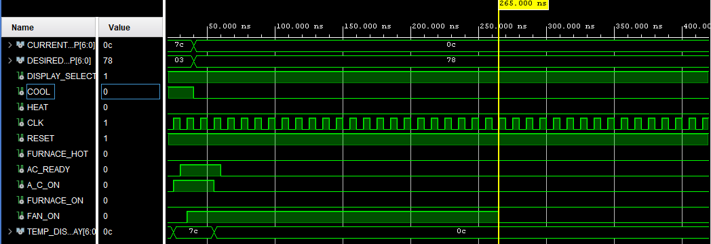

# Waveform Analysis (Lab 5 – Add Counter to Thermostat)

---

### ⚙️ Countdown Operation
- **At 35 ns:** State = `ACNOWREADY` → `countdown_ac = 20 loaded`.  
- **At 55 ns:** State = `ACDONE` → Counter starts decrementing by 1 each rising edge (10 ns period).  
- **From 65 ns → 255 ns:** `countdown_ac` decreases from 20 → 0.  
- **At 255 ns:** `AC_READY = '0'` and `countdown_ac = 0` → FSM computes `NEXT_STATE = IDLE`.  
- **At 265 ns:** `CURRENT_STATE` updates to `IDLE` (one clock cycle delay), turning off all outputs.

---
### 🌀 One-Cycle Delay Explanation (Easier Version)

At **255 ns**, the circuit already calculates that the next state should be **IDLE**, because the `countdown_ac` has reached **0** and `AC_READY = '0'`.
However, at the **same time**, the **output flip-flop (CURRENT_STATE)** is still **checking its input (`NEXT_STATE`)** at that moment.
Since the input (`NEXT_STATE`) is still showing **ACDONE** right then, the output (`CURRENT_STATE`) also stays in **ACDONE** for one more clock cycle.

When the next clock rising edge arrives at **265 ns**, the flip-flop finally **updates its output** to the new value (**IDLE**).
That’s why you see the actual change one cycle later — this is the **one-cycle delay** caused by the flip-flop updating only on each clock edge.

---

### 🔍 Output Summary
| Time (ns) | State | A_C_ON | FURNACE_ON | FAN_ON | countdown_ac |
|:--:|:--:|:--:|:--:|:--:|:--:|
| 35 | ACNOWREADY | 1 | 0 | 1 | 20 (load) |
| 55 | ACDONE | 0 | 0 | 1 | 19 |
| 65 → 255 | ACDONE | 0 | 0 | 1 | 18 → 0 |
| 265 | IDLE | 0 | 0 | 0 | — |

---

### 🧾 Conclusion
The counter and function logic works as expected.   
The A/C and Furnace cool-down processes now include timed delays before returning to `IDLE`, and the waveform confirms the one-cycle flip-flop delay behavior.

