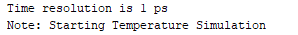
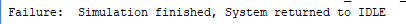

## 🧪 Testbench Procedure Simplification

In **Lab 6**, we introduce a **procedure** to simplify repetitive input assignments in the testbench.
Previously, each signal had to be written separately with individual `<=` statements and `wait` commands, for example:

```vhdl
CURRENT_TEMP <= "0000000";
DESIRED_TEMP <= "1111111";
DISPLAY_SELECT <= '0';
COOL <= '0';
HEAT <= '1';
wait for 10 ns;
```

This approach works, but it makes the testbench long and difficult to read when there are many test cases.

---

### 🧩 Introducing the `ApplyInputs` Procedure

To make the testbench cleaner, we define a **procedure** named `ApplyInputs` inside the process.
It groups all signal assignments and delay timing into one reusable block:

```vhdl
procedure ApplyInputs(
  signal CURRENT_TEMP   : out std_logic_vector(6 downto 0);
  signal DESIRED_TEMP   : out std_logic_vector(6 downto 0);
  signal DISPLAY_SELECT : out std_logic;
  signal COOL           : out std_logic;
  signal HEAT           : out std_logic;
  constant curr_val     : in std_logic_vector(6 downto 0);
  constant des_val      : in std_logic_vector(6 downto 0);
  constant disp_val     : in std_logic;
  constant cool_val     : in std_logic;
  constant heat_val     : in std_logic;
  constant delay_time   : in time
) is
begin
  CURRENT_TEMP   <= curr_val;
  DESIRED_TEMP   <= des_val;
  DISPLAY_SELECT <= disp_val;
  COOL           <= cool_val;
  HEAT           <= heat_val;
  wait for delay_time;
end procedure;
```

---

### 💡 Example of Simplified Input

Instead of five signal lines plus one wait statement,
we can now use **a single line** to assign and delay together:

```vhdl
ApplyInputs(CURRENT_TEMP, DESIRED_TEMP, DISPLAY_SELECT, COOL, HEAT,
            "0000000", "1111111", '0', '0', '1', 10 ns);
```

Here’s what happens internally:

* `"0000000"` → assigned to `CURRENT_TEMP`
* `"1111111"` → assigned to `DESIRED_TEMP`
* `'0'` and `'1'` → assigned to control inputs
* `10 ns` → used as the simulation delay
  After these assignments, the values are transferred into the **signal wires**, which then connect to the **port names** of the RTL design via the `UUT` (Unit Under Test).

---
## 🧭 Simulation Start and End Indicators

At the beginning of the simulation, we use an **assert statement** to clearly indicate when the testbench starts running:

```vhdl
assert false report "Starting Temperature Simulation" severity note;
```

This line does not stop the simulation — it simply prints a message in the console or transcript window (Vivado Simulation Log) to mark the **starting point** of the test.

🖼️ Example output message shown in the simulation log:

```
Note: Starting Temperature Simulation
```

📸 **Screenshot:**


---

### 🔚 Simulation End Message

When all test inputs have been applied and the thermostat returns to the **IDLE** state,
we use another `assert` line to mark the **completion** of the entire simulation:

```vhdl
assert false report " Simulation finished, System returned to IDLE" severity failure;
```

This time, the **severity level** is set to `failure`, which causes the simulation to stop automatically,
indicating that all tests have completed successfully and the system returned to its final state.

🖼️ Example output message shown in the console:

```
Failure:  Simulation finished, System returned to IDLE
```

📸 **Screenshot:**


---
